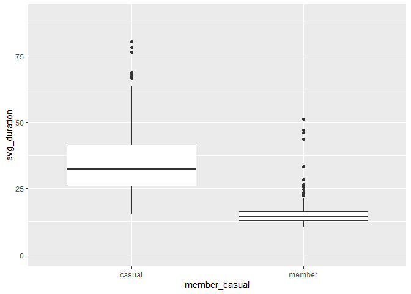
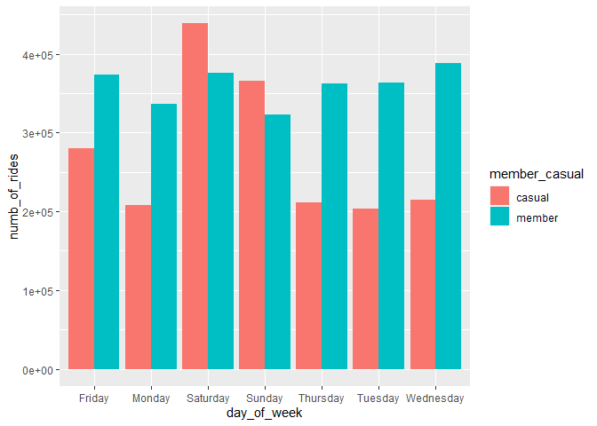
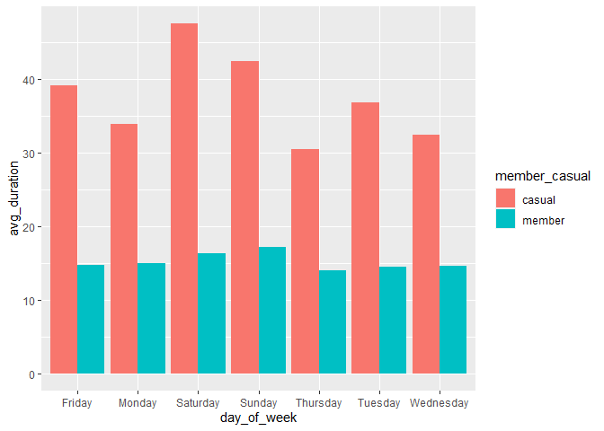
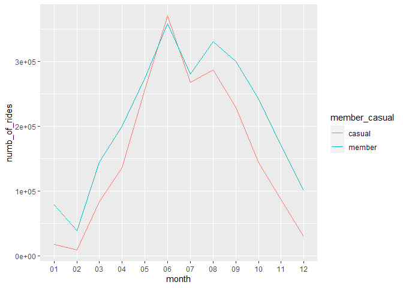

Exploratory Analysis of Bike-Share Trip Data
================

## Introduction To Business Problem

Use bicycle share services has grown in cities across the US both as a
means of transportation and for exercise. These bikes allow users to
pay, use, and return bikes electronically, which means data about bikes,
stations, and trips are recorded and stored.

In this case study, I will analyze bike trip data provided from
bike-share management company that operates around the US,
[Motivate](https://www.motivateco.com/). The ride data I am using is
from a bike-share service in Chicago that Motivate operates called
Divvy. The data is available for use per this
[license](https://www.divvybikes.com/data-license-agreement). For the
purpose of this project I will use the name Cyclistic to refer to a
fictional company that also operates in Chicago. This fictional company
offers three passes to access their bikes: one-time use, single day
pass, and an annual membership. One-time and single day passes are
considered casual users and customers who purchase annual memberships
are referred to as members. In this project I will perform exploratory
analysis to bike trip data to understand how casual riders and annual
members use Cyclistic bikes differently. The goal of this analysis would
be to come up with recommendations for a new marketing strategy to
convert casual riders into annual members. Then our team will use
insights from casual riders vs annual member trends and think about “why
would casual riders buy Cyclistic annual memberships?” in order to come
up with recommendations for a new marketing strategy to convert casual
riders into annual members

## Asking Business Task Centric Questions

Below are some questions that need to be asked regarding the business
task.

1.  What metrics will I need to compare bike-share users usage?

-   trip duration
-   trip time
-   trip date
-   user type

2.  What time frames will I need to analyze?

-   Past 12 months to find any seasonal trends
-   Look at usage per each day of the week to look at weekly trends

3.  What tools will I use for data cleaning and analysis?

## Collection And Importation Of Data

The raw trip data was made available
[here](https://divvy-tripdata.s3.amazonaws.com/index.html). The data is
release as csv files one for each month. I used data from the past 12
months each file consist of trip data. The raw contained the following
variables:

-   ride\_id - to keep track of individual trips taken
-   rideable\_type - type of bike used
-   start\_at - datetime ride started
-   ended\_at - datetime ride ended
-   start\_station\_name - to identify start station
-   start\_station\_id - to identify start station
-   end\_station\_name - to identify end station
-   end\_station\_id - to identify end station
-   4 columns consisting of coordinate data of start and end station
-   member\_casual - user type

I used RStudio and the tidyverse, lubridate, and ggplot2 packages to
import, clean, and aggregate this data. Before the data was imported I
checked where the working directory was and then set the working
directory to easily access raw data files and eventually save the files
of aggregated data.

``` r
library(mrdwabmisc)
```

    ## Loading required package: digest

    ## Loading required package: data.table

    ## Loading required package: splitstackshape

``` r
library(tidyverse)
```

    ## -- Attaching packages --------------------------------------- tidyverse 1.3.1 --

    ## v ggplot2 3.3.5     v purrr   0.3.4
    ## v tibble  3.1.2     v dplyr   1.0.7
    ## v tidyr   1.1.3     v stringr 1.4.0
    ## v readr   1.4.0     v forcats 0.5.1

    ## -- Conflicts ------------------------------------------ tidyverse_conflicts() --
    ## x dplyr::between()   masks data.table::between()
    ## x dplyr::filter()    masks stats::filter()
    ## x dplyr::first()     masks data.table::first()
    ## x dplyr::lag()       masks stats::lag()
    ## x dplyr::last()      masks data.table::last()
    ## x purrr::transpose() masks data.table::transpose()

``` r
library(lubridate)
```

    ## 
    ## Attaching package: 'lubridate'

    ## The following objects are masked from 'package:data.table':
    ## 
    ##     hour, isoweek, mday, minute, month, quarter, second, wday, week,
    ##     yday, year

    ## The following objects are masked from 'package:base':
    ## 
    ##     date, intersect, setdiff, union

``` r
library(ggplot2)

getwd() #check working directory
```

    ## [1] "C:/Users/acofi/Documents/GitHub/divvy_case_study"

``` r
setwd("/users/acofi/Documents/Data_Analysis/Cousera/Portfolio & Case Study/Case Study #1") #set working directory

#use read_csv function to import the 12 csv files as dataframes.
`202007` <- read_csv("Raw Data/202007-divvy-tripdata.csv")
```

    ## 
    ## -- Column specification --------------------------------------------------------
    ## cols(
    ##   ride_id = col_character(),
    ##   rideable_type = col_character(),
    ##   started_at = col_datetime(format = ""),
    ##   ended_at = col_datetime(format = ""),
    ##   start_station_name = col_character(),
    ##   start_station_id = col_double(),
    ##   end_station_name = col_character(),
    ##   end_station_id = col_double(),
    ##   start_lat = col_double(),
    ##   start_lng = col_double(),
    ##   end_lat = col_double(),
    ##   end_lng = col_double(),
    ##   member_casual = col_character()
    ## )

``` r
`202008` <- read_csv("Raw Data/202008-divvy-tripdata.csv")
```

    ## 
    ## -- Column specification --------------------------------------------------------
    ## cols(
    ##   ride_id = col_character(),
    ##   rideable_type = col_character(),
    ##   started_at = col_datetime(format = ""),
    ##   ended_at = col_datetime(format = ""),
    ##   start_station_name = col_character(),
    ##   start_station_id = col_double(),
    ##   end_station_name = col_character(),
    ##   end_station_id = col_double(),
    ##   start_lat = col_double(),
    ##   start_lng = col_double(),
    ##   end_lat = col_double(),
    ##   end_lng = col_double(),
    ##   member_casual = col_character()
    ## )

``` r
`202009` <- read_csv("Raw Data/202009-divvy-tripdata.csv")
```

    ## 
    ## -- Column specification --------------------------------------------------------
    ## cols(
    ##   ride_id = col_character(),
    ##   rideable_type = col_character(),
    ##   started_at = col_datetime(format = ""),
    ##   ended_at = col_datetime(format = ""),
    ##   start_station_name = col_character(),
    ##   start_station_id = col_double(),
    ##   end_station_name = col_character(),
    ##   end_station_id = col_double(),
    ##   start_lat = col_double(),
    ##   start_lng = col_double(),
    ##   end_lat = col_double(),
    ##   end_lng = col_double(),
    ##   member_casual = col_character()
    ## )

``` r
`202010` <- read_csv("Raw Data/202010-divvy-tripdata.csv")
```

    ## 
    ## -- Column specification --------------------------------------------------------
    ## cols(
    ##   ride_id = col_character(),
    ##   rideable_type = col_character(),
    ##   started_at = col_datetime(format = ""),
    ##   ended_at = col_datetime(format = ""),
    ##   start_station_name = col_character(),
    ##   start_station_id = col_double(),
    ##   end_station_name = col_character(),
    ##   end_station_id = col_double(),
    ##   start_lat = col_double(),
    ##   start_lng = col_double(),
    ##   end_lat = col_double(),
    ##   end_lng = col_double(),
    ##   member_casual = col_character()
    ## )

``` r
`202011` <- read_csv("Raw Data/202011-divvy-tripdata.csv")
```

    ## 
    ## -- Column specification --------------------------------------------------------
    ## cols(
    ##   ride_id = col_character(),
    ##   rideable_type = col_character(),
    ##   started_at = col_datetime(format = ""),
    ##   ended_at = col_datetime(format = ""),
    ##   start_station_name = col_character(),
    ##   start_station_id = col_double(),
    ##   end_station_name = col_character(),
    ##   end_station_id = col_double(),
    ##   start_lat = col_double(),
    ##   start_lng = col_double(),
    ##   end_lat = col_double(),
    ##   end_lng = col_double(),
    ##   member_casual = col_character()
    ## )

``` r
`202012` <- read_csv("Raw Data/202012-divvy-tripdata.csv")
```

    ## 
    ## -- Column specification --------------------------------------------------------
    ## cols(
    ##   ride_id = col_character(),
    ##   rideable_type = col_character(),
    ##   started_at = col_datetime(format = ""),
    ##   ended_at = col_datetime(format = ""),
    ##   start_station_name = col_character(),
    ##   start_station_id = col_character(),
    ##   end_station_name = col_character(),
    ##   end_station_id = col_character(),
    ##   start_lat = col_double(),
    ##   start_lng = col_double(),
    ##   end_lat = col_double(),
    ##   end_lng = col_double(),
    ##   member_casual = col_character()
    ## )

``` r
`202101` <- read_csv("Raw Data/202101-divvy-tripdata.csv")
```

    ## 
    ## -- Column specification --------------------------------------------------------
    ## cols(
    ##   ride_id = col_character(),
    ##   rideable_type = col_character(),
    ##   started_at = col_datetime(format = ""),
    ##   ended_at = col_datetime(format = ""),
    ##   start_station_name = col_character(),
    ##   start_station_id = col_character(),
    ##   end_station_name = col_character(),
    ##   end_station_id = col_character(),
    ##   start_lat = col_double(),
    ##   start_lng = col_double(),
    ##   end_lat = col_double(),
    ##   end_lng = col_double(),
    ##   member_casual = col_character()
    ## )

``` r
`202102` <- read_csv("Raw Data/202102-divvy-tripdata.csv")
```

    ## 
    ## -- Column specification --------------------------------------------------------
    ## cols(
    ##   ride_id = col_character(),
    ##   rideable_type = col_character(),
    ##   started_at = col_datetime(format = ""),
    ##   ended_at = col_datetime(format = ""),
    ##   start_station_name = col_character(),
    ##   start_station_id = col_character(),
    ##   end_station_name = col_character(),
    ##   end_station_id = col_character(),
    ##   start_lat = col_double(),
    ##   start_lng = col_double(),
    ##   end_lat = col_double(),
    ##   end_lng = col_double(),
    ##   member_casual = col_character()
    ## )

``` r
`202103` <- read_csv("Raw Data/202103-divvy-tripdata.csv")
```

    ## 
    ## -- Column specification --------------------------------------------------------
    ## cols(
    ##   ride_id = col_character(),
    ##   rideable_type = col_character(),
    ##   started_at = col_datetime(format = ""),
    ##   ended_at = col_datetime(format = ""),
    ##   start_station_name = col_character(),
    ##   start_station_id = col_character(),
    ##   end_station_name = col_character(),
    ##   end_station_id = col_character(),
    ##   start_lat = col_double(),
    ##   start_lng = col_double(),
    ##   end_lat = col_double(),
    ##   end_lng = col_double(),
    ##   member_casual = col_character()
    ## )

``` r
`202104` <- read_csv("Raw Data/202104-divvy-tripdata.csv")
```

    ## 
    ## -- Column specification --------------------------------------------------------
    ## cols(
    ##   ride_id = col_character(),
    ##   rideable_type = col_character(),
    ##   started_at = col_datetime(format = ""),
    ##   ended_at = col_datetime(format = ""),
    ##   start_station_name = col_character(),
    ##   start_station_id = col_character(),
    ##   end_station_name = col_character(),
    ##   end_station_id = col_character(),
    ##   start_lat = col_double(),
    ##   start_lng = col_double(),
    ##   end_lat = col_double(),
    ##   end_lng = col_double(),
    ##   member_casual = col_character()
    ## )

``` r
`202105` <- read_csv("Raw Data/202105-divvy-tripdata.csv")
```

    ## 
    ## -- Column specification --------------------------------------------------------
    ## cols(
    ##   ride_id = col_character(),
    ##   rideable_type = col_character(),
    ##   started_at = col_datetime(format = ""),
    ##   ended_at = col_datetime(format = ""),
    ##   start_station_name = col_character(),
    ##   start_station_id = col_character(),
    ##   end_station_name = col_character(),
    ##   end_station_id = col_character(),
    ##   start_lat = col_double(),
    ##   start_lng = col_double(),
    ##   end_lat = col_double(),
    ##   end_lng = col_double(),
    ##   member_casual = col_character()
    ## )

``` r
`202106` <- read_csv("Raw Data/202106-divvy-tripdata.csv")
```

    ## 
    ## -- Column specification --------------------------------------------------------
    ## cols(
    ##   ride_id = col_character(),
    ##   rideable_type = col_character(),
    ##   started_at = col_datetime(format = ""),
    ##   ended_at = col_datetime(format = ""),
    ##   start_station_name = col_character(),
    ##   start_station_id = col_character(),
    ##   end_station_name = col_character(),
    ##   end_station_id = col_character(),
    ##   start_lat = col_double(),
    ##   start_lng = col_double(),
    ##   end_lat = col_double(),
    ##   end_lng = col_double(),
    ##   member_casual = col_character()
    ## )

## Data Inspected For Validity And Merged

Column specifications are listed in the console after each file is
imported. This is where I saw that the “station\_start\_id” and
“end\_station\_id” variable were of the numeric type double for the data
files from July 2020 through November 2020. The other 7 files had those
two columns as characters. In order to merge all 12 files into one file
to clean I converted the any station\_id variable that was a numeric
vector into a character vector.

The data was then inspected for further quality validity using the str()
function and then the rows in all 12 files were merged into a single
dataframe.

``` r
# start_station_id and end_station_id are a double for the first 5 files and they are a character for the rest.
`202007` <- mutate(`202007`, start_station_id = as.character(start_station_id), end_station_id = as.character(end_station_id))
`202008` <- mutate(`202008`, start_station_id = as.character(start_station_id), end_station_id = as.character(end_station_id))
`202009` <- mutate(`202009`, start_station_id = as.character(start_station_id), end_station_id = as.character(end_station_id))
`202010` <- mutate(`202010`, start_station_id = as.character(start_station_id), end_station_id = as.character(end_station_id))
`202011` <- mutate(`202011`, start_station_id = as.character(start_station_id), end_station_id = as.character(end_station_id))


str(`202007`)
```

    ## spec_tbl_df [551,480 x 13] (S3: spec_tbl_df/tbl_df/tbl/data.frame)
    ##  $ ride_id           : chr [1:551480] "762198876D69004D" "BEC9C9FBA0D4CF1B" "D2FD8EA432C77EC1" "54AE594E20B35881" ...
    ##  $ rideable_type     : chr [1:551480] "docked_bike" "docked_bike" "docked_bike" "docked_bike" ...
    ##  $ started_at        : POSIXct[1:551480], format: "2020-07-09 15:22:02" "2020-07-24 23:56:30" ...
    ##  $ ended_at          : POSIXct[1:551480], format: "2020-07-09 15:25:52" "2020-07-25 00:20:17" ...
    ##  $ start_station_name: chr [1:551480] "Ritchie Ct & Banks St" "Halsted St & Roscoe St" "Lake Shore Dr & Diversey Pkwy" "LaSalle St & Illinois St" ...
    ##  $ start_station_id  : chr [1:551480] "180" "299" "329" "181" ...
    ##  $ end_station_name  : chr [1:551480] "Wells St & Evergreen Ave" "Broadway & Ridge Ave" "Clark St & Wellington Ave" "Clark St & Armitage Ave" ...
    ##  $ end_station_id    : chr [1:551480] "291" "461" "156" "94" ...
    ##  $ start_lat         : num [1:551480] 41.9 41.9 41.9 41.9 41.9 ...
    ##  $ start_lng         : num [1:551480] -87.6 -87.6 -87.6 -87.6 -87.6 ...
    ##  $ end_lat           : num [1:551480] 41.9 42 41.9 41.9 41.9 ...
    ##  $ end_lng           : num [1:551480] -87.6 -87.7 -87.6 -87.6 -87.6 ...
    ##  $ member_casual     : chr [1:551480] "member" "member" "casual" "casual" ...
    ##  - attr(*, "spec")=
    ##   .. cols(
    ##   ..   ride_id = col_character(),
    ##   ..   rideable_type = col_character(),
    ##   ..   started_at = col_datetime(format = ""),
    ##   ..   ended_at = col_datetime(format = ""),
    ##   ..   start_station_name = col_character(),
    ##   ..   start_station_id = col_double(),
    ##   ..   end_station_name = col_character(),
    ##   ..   end_station_id = col_double(),
    ##   ..   start_lat = col_double(),
    ##   ..   start_lng = col_double(),
    ##   ..   end_lat = col_double(),
    ##   ..   end_lng = col_double(),
    ##   ..   member_casual = col_character()
    ##   .. )

``` r
str(`202008`)
```

    ## spec_tbl_df [622,361 x 13] (S3: spec_tbl_df/tbl_df/tbl/data.frame)
    ##  $ ride_id           : chr [1:622361] "322BD23D287743ED" "2A3AEF1AB9054D8B" "67DC1D133E8B5816" "C79FBBD412E578A7" ...
    ##  $ rideable_type     : chr [1:622361] "docked_bike" "electric_bike" "electric_bike" "electric_bike" ...
    ##  $ started_at        : POSIXct[1:622361], format: "2020-08-20 18:08:14" "2020-08-27 18:46:04" ...
    ##  $ ended_at          : POSIXct[1:622361], format: "2020-08-20 18:17:51" "2020-08-27 19:54:51" ...
    ##  $ start_station_name: chr [1:622361] "Lake Shore Dr & Diversey Pkwy" "Michigan Ave & 14th St" "Columbus Dr & Randolph St" "Daley Center Plaza" ...
    ##  $ start_station_id  : chr [1:622361] "329" "168" "195" "81" ...
    ##  $ end_station_name  : chr [1:622361] "Clark St & Lincoln Ave" "Michigan Ave & 14th St" "State St & Randolph St" "State St & Kinzie St" ...
    ##  $ end_station_id    : chr [1:622361] "141" "168" "44" "47" ...
    ##  $ start_lat         : num [1:622361] 41.9 41.9 41.9 41.9 41.9 ...
    ##  $ start_lng         : num [1:622361] -87.6 -87.6 -87.6 -87.6 -87.7 ...
    ##  $ end_lat           : num [1:622361] 41.9 41.9 41.9 41.9 41.9 ...
    ##  $ end_lng           : num [1:622361] -87.6 -87.6 -87.6 -87.6 -87.7 ...
    ##  $ member_casual     : chr [1:622361] "member" "casual" "casual" "casual" ...
    ##  - attr(*, "spec")=
    ##   .. cols(
    ##   ..   ride_id = col_character(),
    ##   ..   rideable_type = col_character(),
    ##   ..   started_at = col_datetime(format = ""),
    ##   ..   ended_at = col_datetime(format = ""),
    ##   ..   start_station_name = col_character(),
    ##   ..   start_station_id = col_double(),
    ##   ..   end_station_name = col_character(),
    ##   ..   end_station_id = col_double(),
    ##   ..   start_lat = col_double(),
    ##   ..   start_lng = col_double(),
    ##   ..   end_lat = col_double(),
    ##   ..   end_lng = col_double(),
    ##   ..   member_casual = col_character()
    ##   .. )

``` r
str(`202010`)
```

    ## spec_tbl_df [388,653 x 13] (S3: spec_tbl_df/tbl_df/tbl/data.frame)
    ##  $ ride_id           : chr [1:388653] "ACB6B40CF5B9044C" "DF450C72FD109C01" "B6396B54A15AC0DF" "44A4AEE261B9E854" ...
    ##  $ rideable_type     : chr [1:388653] "electric_bike" "electric_bike" "electric_bike" "electric_bike" ...
    ##  $ started_at        : POSIXct[1:388653], format: "2020-10-31 19:39:43" "2020-10-31 23:50:08" ...
    ##  $ ended_at          : POSIXct[1:388653], format: "2020-10-31 19:57:12" "2020-11-01 00:04:16" ...
    ##  $ start_station_name: chr [1:388653] "Lakeview Ave & Fullerton Pkwy" "Southport Ave & Waveland Ave" "Stony Island Ave & 67th St" "Clark St & Grace St" ...
    ##  $ start_station_id  : chr [1:388653] "313" "227" "102" "165" ...
    ##  $ end_station_name  : chr [1:388653] "Rush St & Hubbard St" "Kedzie Ave & Milwaukee Ave" "University Ave & 57th St" "Broadway & Sheridan Rd" ...
    ##  $ end_station_id    : chr [1:388653] "125" "260" "423" "256" ...
    ##  $ start_lat         : num [1:388653] 41.9 41.9 41.8 42 41.9 ...
    ##  $ start_lng         : num [1:388653] -87.6 -87.7 -87.6 -87.7 -87.7 ...
    ##  $ end_lat           : num [1:388653] 41.9 41.9 41.8 42 41.9 ...
    ##  $ end_lng           : num [1:388653] -87.6 -87.7 -87.6 -87.7 -87.7 ...
    ##  $ member_casual     : chr [1:388653] "casual" "casual" "casual" "casual" ...
    ##  - attr(*, "spec")=
    ##   .. cols(
    ##   ..   ride_id = col_character(),
    ##   ..   rideable_type = col_character(),
    ##   ..   started_at = col_datetime(format = ""),
    ##   ..   ended_at = col_datetime(format = ""),
    ##   ..   start_station_name = col_character(),
    ##   ..   start_station_id = col_double(),
    ##   ..   end_station_name = col_character(),
    ##   ..   end_station_id = col_double(),
    ##   ..   start_lat = col_double(),
    ##   ..   start_lng = col_double(),
    ##   ..   end_lat = col_double(),
    ##   ..   end_lng = col_double(),
    ##   ..   member_casual = col_character()
    ##   .. )

``` r
str(`202011`)
```

    ## spec_tbl_df [259,716 x 13] (S3: spec_tbl_df/tbl_df/tbl/data.frame)
    ##  $ ride_id           : chr [1:259716] "BD0A6FF6FFF9B921" "96A7A7A4BDE4F82D" "C61526D06582BDC5" "E533E89C32080B9E" ...
    ##  $ rideable_type     : chr [1:259716] "electric_bike" "electric_bike" "electric_bike" "electric_bike" ...
    ##  $ started_at        : POSIXct[1:259716], format: "2020-11-01 13:36:00" "2020-11-01 10:03:26" ...
    ##  $ ended_at          : POSIXct[1:259716], format: "2020-11-01 13:45:40" "2020-11-01 10:14:45" ...
    ##  $ start_station_name: chr [1:259716] "Dearborn St & Erie St" "Franklin St & Illinois St" "Lake Shore Dr & Monroe St" "Leavitt St & Chicago Ave" ...
    ##  $ start_station_id  : chr [1:259716] "110" "672" "76" "659" ...
    ##  $ end_station_name  : chr [1:259716] "St. Clair St & Erie St" "Noble St & Milwaukee Ave" "Federal St & Polk St" "Stave St & Armitage Ave" ...
    ##  $ end_station_id    : chr [1:259716] "211" "29" "41" "185" ...
    ##  $ start_lat         : num [1:259716] 41.9 41.9 41.9 41.9 41.9 ...
    ##  $ start_lng         : num [1:259716] -87.6 -87.6 -87.6 -87.7 -87.6 ...
    ##  $ end_lat           : num [1:259716] 41.9 41.9 41.9 41.9 41.9 ...
    ##  $ end_lng           : num [1:259716] -87.6 -87.7 -87.6 -87.7 -87.6 ...
    ##  $ member_casual     : chr [1:259716] "casual" "casual" "casual" "casual" ...
    ##  - attr(*, "spec")=
    ##   .. cols(
    ##   ..   ride_id = col_character(),
    ##   ..   rideable_type = col_character(),
    ##   ..   started_at = col_datetime(format = ""),
    ##   ..   ended_at = col_datetime(format = ""),
    ##   ..   start_station_name = col_character(),
    ##   ..   start_station_id = col_double(),
    ##   ..   end_station_name = col_character(),
    ##   ..   end_station_id = col_double(),
    ##   ..   start_lat = col_double(),
    ##   ..   start_lng = col_double(),
    ##   ..   end_lat = col_double(),
    ##   ..   end_lng = col_double(),
    ##   ..   member_casual = col_character()
    ##   .. )

``` r
str(`202012`)
```

    ## spec_tbl_df [131,573 x 13] (S3: spec_tbl_df/tbl_df/tbl/data.frame)
    ##  $ ride_id           : chr [1:131573] "70B6A9A437D4C30D" "158A465D4E74C54A" "5262016E0F1F2F9A" "BE119628E44F871E" ...
    ##  $ rideable_type     : chr [1:131573] "classic_bike" "electric_bike" "electric_bike" "electric_bike" ...
    ##  $ started_at        : POSIXct[1:131573], format: "2020-12-27 12:44:29" "2020-12-18 17:37:15" ...
    ##  $ ended_at          : POSIXct[1:131573], format: "2020-12-27 12:55:06" "2020-12-18 17:44:19" ...
    ##  $ start_station_name: chr [1:131573] "Aberdeen St & Jackson Blvd" NA NA NA ...
    ##  $ start_station_id  : chr [1:131573] "13157" NA NA NA ...
    ##  $ end_station_name  : chr [1:131573] "Desplaines St & Kinzie St" NA NA NA ...
    ##  $ end_station_id    : chr [1:131573] "TA1306000003" NA NA NA ...
    ##  $ start_lat         : num [1:131573] 41.9 41.9 41.9 41.9 41.8 ...
    ##  $ start_lng         : num [1:131573] -87.7 -87.7 -87.7 -87.7 -87.6 ...
    ##  $ end_lat           : num [1:131573] 41.9 41.9 41.9 41.9 41.8 ...
    ##  $ end_lng           : num [1:131573] -87.6 -87.7 -87.7 -87.7 -87.6 ...
    ##  $ member_casual     : chr [1:131573] "member" "member" "member" "member" ...
    ##  - attr(*, "spec")=
    ##   .. cols(
    ##   ..   ride_id = col_character(),
    ##   ..   rideable_type = col_character(),
    ##   ..   started_at = col_datetime(format = ""),
    ##   ..   ended_at = col_datetime(format = ""),
    ##   ..   start_station_name = col_character(),
    ##   ..   start_station_id = col_character(),
    ##   ..   end_station_name = col_character(),
    ##   ..   end_station_id = col_character(),
    ##   ..   start_lat = col_double(),
    ##   ..   start_lng = col_double(),
    ##   ..   end_lat = col_double(),
    ##   ..   end_lng = col_double(),
    ##   ..   member_casual = col_character()
    ##   .. )

``` r
str(`202101`)
```

    ## spec_tbl_df [96,834 x 13] (S3: spec_tbl_df/tbl_df/tbl/data.frame)
    ##  $ ride_id           : chr [1:96834] "E19E6F1B8D4C42ED" "DC88F20C2C55F27F" "EC45C94683FE3F27" "4FA453A75AE377DB" ...
    ##  $ rideable_type     : chr [1:96834] "electric_bike" "electric_bike" "electric_bike" "electric_bike" ...
    ##  $ started_at        : POSIXct[1:96834], format: "2021-01-23 16:14:19" "2021-01-27 18:43:08" ...
    ##  $ ended_at          : POSIXct[1:96834], format: "2021-01-23 16:24:44" "2021-01-27 18:47:12" ...
    ##  $ start_station_name: chr [1:96834] "California Ave & Cortez St" "California Ave & Cortez St" "California Ave & Cortez St" "California Ave & Cortez St" ...
    ##  $ start_station_id  : chr [1:96834] "17660" "17660" "17660" "17660" ...
    ##  $ end_station_name  : chr [1:96834] NA NA NA NA ...
    ##  $ end_station_id    : chr [1:96834] NA NA NA NA ...
    ##  $ start_lat         : num [1:96834] 41.9 41.9 41.9 41.9 41.9 ...
    ##  $ start_lng         : num [1:96834] -87.7 -87.7 -87.7 -87.7 -87.7 ...
    ##  $ end_lat           : num [1:96834] 41.9 41.9 41.9 41.9 41.9 ...
    ##  $ end_lng           : num [1:96834] -87.7 -87.7 -87.7 -87.7 -87.7 ...
    ##  $ member_casual     : chr [1:96834] "member" "member" "member" "member" ...
    ##  - attr(*, "spec")=
    ##   .. cols(
    ##   ..   ride_id = col_character(),
    ##   ..   rideable_type = col_character(),
    ##   ..   started_at = col_datetime(format = ""),
    ##   ..   ended_at = col_datetime(format = ""),
    ##   ..   start_station_name = col_character(),
    ##   ..   start_station_id = col_character(),
    ##   ..   end_station_name = col_character(),
    ##   ..   end_station_id = col_character(),
    ##   ..   start_lat = col_double(),
    ##   ..   start_lng = col_double(),
    ##   ..   end_lat = col_double(),
    ##   ..   end_lng = col_double(),
    ##   ..   member_casual = col_character()
    ##   .. )

``` r
str(`202102`)
```

    ## spec_tbl_df [49,622 x 13] (S3: spec_tbl_df/tbl_df/tbl/data.frame)
    ##  $ ride_id           : chr [1:49622] "89E7AA6C29227EFF" "0FEFDE2603568365" "E6159D746B2DBB91" "B32D3199F1C2E75B" ...
    ##  $ rideable_type     : chr [1:49622] "classic_bike" "classic_bike" "electric_bike" "classic_bike" ...
    ##  $ started_at        : POSIXct[1:49622], format: "2021-02-12 16:14:56" "2021-02-14 17:52:38" ...
    ##  $ ended_at          : POSIXct[1:49622], format: "2021-02-12 16:21:43" "2021-02-14 18:12:09" ...
    ##  $ start_station_name: chr [1:49622] "Glenwood Ave & Touhy Ave" "Glenwood Ave & Touhy Ave" "Clark St & Lake St" "Wood St & Chicago Ave" ...
    ##  $ start_station_id  : chr [1:49622] "525" "525" "KA1503000012" "637" ...
    ##  $ end_station_name  : chr [1:49622] "Sheridan Rd & Columbia Ave" "Bosworth Ave & Howard St" "State St & Randolph St" "Honore St & Division St" ...
    ##  $ end_station_id    : chr [1:49622] "660" "16806" "TA1305000029" "TA1305000034" ...
    ##  $ start_lat         : num [1:49622] 42 42 41.9 41.9 41.8 ...
    ##  $ start_lng         : num [1:49622] -87.7 -87.7 -87.6 -87.7 -87.6 ...
    ##  $ end_lat           : num [1:49622] 42 42 41.9 41.9 41.8 ...
    ##  $ end_lng           : num [1:49622] -87.7 -87.7 -87.6 -87.7 -87.6 ...
    ##  $ member_casual     : chr [1:49622] "member" "casual" "member" "member" ...
    ##  - attr(*, "spec")=
    ##   .. cols(
    ##   ..   ride_id = col_character(),
    ##   ..   rideable_type = col_character(),
    ##   ..   started_at = col_datetime(format = ""),
    ##   ..   ended_at = col_datetime(format = ""),
    ##   ..   start_station_name = col_character(),
    ##   ..   start_station_id = col_character(),
    ##   ..   end_station_name = col_character(),
    ##   ..   end_station_id = col_character(),
    ##   ..   start_lat = col_double(),
    ##   ..   start_lng = col_double(),
    ##   ..   end_lat = col_double(),
    ##   ..   end_lng = col_double(),
    ##   ..   member_casual = col_character()
    ##   .. )

``` r
str(`202103`)
```

    ## spec_tbl_df [228,496 x 13] (S3: spec_tbl_df/tbl_df/tbl/data.frame)
    ##  $ ride_id           : chr [1:228496] "CFA86D4455AA1030" "30D9DC61227D1AF3" "846D87A15682A284" "994D05AA75A168F2" ...
    ##  $ rideable_type     : chr [1:228496] "classic_bike" "classic_bike" "classic_bike" "classic_bike" ...
    ##  $ started_at        : POSIXct[1:228496], format: "2021-03-16 08:32:30" "2021-03-28 01:26:28" ...
    ##  $ ended_at          : POSIXct[1:228496], format: "2021-03-16 08:36:34" "2021-03-28 01:36:55" ...
    ##  $ start_station_name: chr [1:228496] "Humboldt Blvd & Armitage Ave" "Humboldt Blvd & Armitage Ave" "Shields Ave & 28th Pl" "Winthrop Ave & Lawrence Ave" ...
    ##  $ start_station_id  : chr [1:228496] "15651" "15651" "15443" "TA1308000021" ...
    ##  $ end_station_name  : chr [1:228496] "Stave St & Armitage Ave" "Central Park Ave & Bloomingdale Ave" "Halsted St & 35th St" "Broadway & Sheridan Rd" ...
    ##  $ end_station_id    : chr [1:228496] "13266" "18017" "TA1308000043" "13323" ...
    ##  $ start_lat         : num [1:228496] 41.9 41.9 41.8 42 42 ...
    ##  $ start_lng         : num [1:228496] -87.7 -87.7 -87.6 -87.7 -87.7 ...
    ##  $ end_lat           : num [1:228496] 41.9 41.9 41.8 42 42.1 ...
    ##  $ end_lng           : num [1:228496] -87.7 -87.7 -87.6 -87.6 -87.7 ...
    ##  $ member_casual     : chr [1:228496] "casual" "casual" "casual" "casual" ...
    ##  - attr(*, "spec")=
    ##   .. cols(
    ##   ..   ride_id = col_character(),
    ##   ..   rideable_type = col_character(),
    ##   ..   started_at = col_datetime(format = ""),
    ##   ..   ended_at = col_datetime(format = ""),
    ##   ..   start_station_name = col_character(),
    ##   ..   start_station_id = col_character(),
    ##   ..   end_station_name = col_character(),
    ##   ..   end_station_id = col_character(),
    ##   ..   start_lat = col_double(),
    ##   ..   start_lng = col_double(),
    ##   ..   end_lat = col_double(),
    ##   ..   end_lng = col_double(),
    ##   ..   member_casual = col_character()
    ##   .. )

``` r
str(`202104`)
```

    ## spec_tbl_df [337,230 x 13] (S3: spec_tbl_df/tbl_df/tbl/data.frame)
    ##  $ ride_id           : chr [1:337230] "6C992BD37A98A63F" "1E0145613A209000" "E498E15508A80BAD" "1887262AD101C604" ...
    ##  $ rideable_type     : chr [1:337230] "classic_bike" "docked_bike" "docked_bike" "classic_bike" ...
    ##  $ started_at        : POSIXct[1:337230], format: "2021-04-12 18:25:36" "2021-04-27 17:27:11" ...
    ##  $ ended_at          : POSIXct[1:337230], format: "2021-04-12 18:56:55" "2021-04-27 18:31:29" ...
    ##  $ start_station_name: chr [1:337230] "State St & Pearson St" "Dorchester Ave & 49th St" "Loomis Blvd & 84th St" "Honore St & Division St" ...
    ##  $ start_station_id  : chr [1:337230] "TA1307000061" "KA1503000069" "20121" "TA1305000034" ...
    ##  $ end_station_name  : chr [1:337230] "Southport Ave & Waveland Ave" "Dorchester Ave & 49th St" "Loomis Blvd & 84th St" "Southport Ave & Waveland Ave" ...
    ##  $ end_station_id    : chr [1:337230] "13235" "KA1503000069" "20121" "13235" ...
    ##  $ start_lat         : num [1:337230] 41.9 41.8 41.7 41.9 41.7 ...
    ##  $ start_lng         : num [1:337230] -87.6 -87.6 -87.7 -87.7 -87.7 ...
    ##  $ end_lat           : num [1:337230] 41.9 41.8 41.7 41.9 41.7 ...
    ##  $ end_lng           : num [1:337230] -87.7 -87.6 -87.7 -87.7 -87.7 ...
    ##  $ member_casual     : chr [1:337230] "member" "casual" "casual" "member" ...
    ##  - attr(*, "spec")=
    ##   .. cols(
    ##   ..   ride_id = col_character(),
    ##   ..   rideable_type = col_character(),
    ##   ..   started_at = col_datetime(format = ""),
    ##   ..   ended_at = col_datetime(format = ""),
    ##   ..   start_station_name = col_character(),
    ##   ..   start_station_id = col_character(),
    ##   ..   end_station_name = col_character(),
    ##   ..   end_station_id = col_character(),
    ##   ..   start_lat = col_double(),
    ##   ..   start_lng = col_double(),
    ##   ..   end_lat = col_double(),
    ##   ..   end_lng = col_double(),
    ##   ..   member_casual = col_character()
    ##   .. )

``` r
str(`202105`)
```

    ## spec_tbl_df [531,633 x 13] (S3: spec_tbl_df/tbl_df/tbl/data.frame)
    ##  $ ride_id           : chr [1:531633] "C809ED75D6160B2A" "DD59FDCE0ACACAF3" "0AB83CB88C43EFC2" "7881AC6D39110C60" ...
    ##  $ rideable_type     : chr [1:531633] "electric_bike" "electric_bike" "electric_bike" "electric_bike" ...
    ##  $ started_at        : POSIXct[1:531633], format: "2021-05-30 11:58:15" "2021-05-30 11:29:14" ...
    ##  $ ended_at          : POSIXct[1:531633], format: "2021-05-30 12:10:39" "2021-05-30 12:14:09" ...
    ##  $ start_station_name: chr [1:531633] NA NA NA NA ...
    ##  $ start_station_id  : chr [1:531633] NA NA NA NA ...
    ##  $ end_station_name  : chr [1:531633] NA NA NA NA ...
    ##  $ end_station_id    : chr [1:531633] NA NA NA NA ...
    ##  $ start_lat         : num [1:531633] 41.9 41.9 41.9 41.9 41.9 ...
    ##  $ start_lng         : num [1:531633] -87.6 -87.6 -87.7 -87.7 -87.7 ...
    ##  $ end_lat           : num [1:531633] 41.9 41.8 41.9 41.9 41.9 ...
    ##  $ end_lng           : num [1:531633] -87.6 -87.6 -87.7 -87.7 -87.7 ...
    ##  $ member_casual     : chr [1:531633] "casual" "casual" "casual" "casual" ...
    ##  - attr(*, "spec")=
    ##   .. cols(
    ##   ..   ride_id = col_character(),
    ##   ..   rideable_type = col_character(),
    ##   ..   started_at = col_datetime(format = ""),
    ##   ..   ended_at = col_datetime(format = ""),
    ##   ..   start_station_name = col_character(),
    ##   ..   start_station_id = col_character(),
    ##   ..   end_station_name = col_character(),
    ##   ..   end_station_id = col_character(),
    ##   ..   start_lat = col_double(),
    ##   ..   start_lng = col_double(),
    ##   ..   end_lat = col_double(),
    ##   ..   end_lng = col_double(),
    ##   ..   member_casual = col_character()
    ##   .. )

``` r
str(`202106`)
```

    ## spec_tbl_df [729,595 x 13] (S3: spec_tbl_df/tbl_df/tbl/data.frame)
    ##  $ ride_id           : chr [1:729595] "99FEC93BA843FB20" "06048DCFC8520CAF" "9598066F68045DF2" "B03C0FE48C412214" ...
    ##  $ rideable_type     : chr [1:729595] "electric_bike" "electric_bike" "electric_bike" "electric_bike" ...
    ##  $ started_at        : POSIXct[1:729595], format: "2021-06-13 14:31:28" "2021-06-04 11:18:02" ...
    ##  $ ended_at          : POSIXct[1:729595], format: "2021-06-13 14:34:11" "2021-06-04 11:24:19" ...
    ##  $ start_station_name: chr [1:729595] NA NA NA NA ...
    ##  $ start_station_id  : chr [1:729595] NA NA NA NA ...
    ##  $ end_station_name  : chr [1:729595] NA NA NA NA ...
    ##  $ end_station_id    : chr [1:729595] NA NA NA NA ...
    ##  $ start_lat         : num [1:729595] 41.8 41.8 41.8 41.8 41.8 ...
    ##  $ start_lng         : num [1:729595] -87.6 -87.6 -87.6 -87.6 -87.6 ...
    ##  $ end_lat           : num [1:729595] 41.8 41.8 41.8 41.8 41.8 ...
    ##  $ end_lng           : num [1:729595] -87.6 -87.6 -87.6 -87.6 -87.6 ...
    ##  $ member_casual     : chr [1:729595] "member" "member" "member" "member" ...
    ##  - attr(*, "spec")=
    ##   .. cols(
    ##   ..   ride_id = col_character(),
    ##   ..   rideable_type = col_character(),
    ##   ..   started_at = col_datetime(format = ""),
    ##   ..   ended_at = col_datetime(format = ""),
    ##   ..   start_station_name = col_character(),
    ##   ..   start_station_id = col_character(),
    ##   ..   end_station_name = col_character(),
    ##   ..   end_station_id = col_character(),
    ##   ..   start_lat = col_double(),
    ##   ..   start_lng = col_double(),
    ##   ..   end_lat = col_double(),
    ##   ..   end_lng = col_double(),
    ##   ..   member_casual = col_character()
    ##   .. )

``` r
#combine rows in each dataframe into one dataframe.
all_trips <- bind_rows(`202007`, `202008`, `202009`, `202010`, `202011`, `202012`, `202101`, `202102`, `202103`, `202104`, `202105`, `202106`)
```

## Data Wrangling

Steps in data cleaning process:

1.  Removing columns of data variables that will not be used

-   The four columns on station coordinate data was removed

2.  The single file is further inspected by looking at:

-   column names

-   the number of rows

-   functions to preview data

-   summary() function to look at aggregate summary of values for each
    variable in the data frame

    > I checked that each character vector had the same length and that
    > the “started\_at” variable was within the appropriate ranges of
    > 2020-07-01 to 2021-06-30. The “ended\_at” variable was inspected
    > to make sure the min value was after the min value for
    > “started\_at”.

3.  Columns representing date, month, day, year, and day of the week
    were added so we can aggregate data on these variable to look for
    trends in usage.

<!-- -->

    - as.Date() was used to convert "start_at" variable to a date and the format() function was used to create the other added variables from the date variable.

4.  A column for the duration of the ride is added called
    “ride\_length”. This figure is calculated from the “started\_at” and
    “ended\_at” variables and is then converted into a numeric and then
    divided by 60 to get the ride duration in minutes instead of
    seconds.

``` r
#remove data columns that will not be used 
all_trips <- all_trips %>%
  select(-c(start_lat, start_lng, end_lat, end_lng))

#inspect Data
colnames(all_trips)
```

    ## [1] "ride_id"            "rideable_type"      "started_at"        
    ## [4] "ended_at"           "start_station_name" "start_station_id"  
    ## [7] "end_station_name"   "end_station_id"     "member_casual"

``` r
nrow(all_trips)
```

    ## [1] 4460151

``` r
dim(all_trips)
```

    ## [1] 4460151       9

``` r
head(all_trips)
```

    ## # A tibble: 6 x 9
    ##   ride_id rideable_type started_at          ended_at            start_station_n~
    ##   <chr>   <chr>         <dttm>              <dttm>              <chr>           
    ## 1 762198~ docked_bike   2020-07-09 15:22:02 2020-07-09 15:25:52 Ritchie Ct & Ba~
    ## 2 BEC9C9~ docked_bike   2020-07-24 23:56:30 2020-07-25 00:20:17 Halsted St & Ro~
    ## 3 D2FD8E~ docked_bike   2020-07-08 19:49:07 2020-07-08 19:56:22 Lake Shore Dr &~
    ## 4 54AE59~ docked_bike   2020-07-17 19:06:42 2020-07-17 19:27:38 LaSalle St & Il~
    ## 5 54025F~ docked_bike   2020-07-04 10:39:57 2020-07-04 10:45:05 Lake Shore Dr &~
    ## 6 65636B~ docked_bike   2020-07-28 16:33:03 2020-07-28 16:49:10 Fairbanks St & ~
    ## # ... with 4 more variables: start_station_id <chr>, end_station_name <chr>,
    ## #   end_station_id <chr>, member_casual <chr>

``` r
str(all_trips)
```

    ## tibble [4,460,151 x 9] (S3: tbl_df/tbl/data.frame)
    ##  $ ride_id           : chr [1:4460151] "762198876D69004D" "BEC9C9FBA0D4CF1B" "D2FD8EA432C77EC1" "54AE594E20B35881" ...
    ##  $ rideable_type     : chr [1:4460151] "docked_bike" "docked_bike" "docked_bike" "docked_bike" ...
    ##  $ started_at        : POSIXct[1:4460151], format: "2020-07-09 15:22:02" "2020-07-24 23:56:30" ...
    ##  $ ended_at          : POSIXct[1:4460151], format: "2020-07-09 15:25:52" "2020-07-25 00:20:17" ...
    ##  $ start_station_name: chr [1:4460151] "Ritchie Ct & Banks St" "Halsted St & Roscoe St" "Lake Shore Dr & Diversey Pkwy" "LaSalle St & Illinois St" ...
    ##  $ start_station_id  : chr [1:4460151] "180" "299" "329" "181" ...
    ##  $ end_station_name  : chr [1:4460151] "Wells St & Evergreen Ave" "Broadway & Ridge Ave" "Clark St & Wellington Ave" "Clark St & Armitage Ave" ...
    ##  $ end_station_id    : chr [1:4460151] "291" "461" "156" "94" ...
    ##  $ member_casual     : chr [1:4460151] "member" "member" "casual" "casual" ...

``` r
summary(all_trips)
```

    ##    ride_id          rideable_type        started_at                 
    ##  Length:4460151     Length:4460151     Min.   :2020-07-01 00:00:14  
    ##  Class :character   Class :character   1st Qu.:2020-08-29 14:06:10  
    ##  Mode  :character   Mode  :character   Median :2020-11-11 11:51:43  
    ##                                        Mean   :2020-12-25 05:10:09  
    ##                                        3rd Qu.:2021-05-11 20:43:11  
    ##                                        Max.   :2021-06-30 23:59:59  
    ##     ended_at                   start_station_name start_station_id  
    ##  Min.   :2020-07-01 00:03:01   Length:4460151     Length:4460151    
    ##  1st Qu.:2020-08-29 14:35:14   Class :character   Class :character  
    ##  Median :2020-11-11 12:08:21   Mode  :character   Mode  :character  
    ##  Mean   :2020-12-25 05:33:58                                        
    ##  3rd Qu.:2021-05-11 21:00:43                                        
    ##  Max.   :2021-07-13 22:51:35                                        
    ##  end_station_name   end_station_id     member_casual     
    ##  Length:4460151     Length:4460151     Length:4460151    
    ##  Class :character   Class :character   Class :character  
    ##  Mode  :character   Mode  :character   Mode  :character  
    ##                                                          
    ##                                                          
    ## 

``` r
#add columns for date, month, day, and year for further aggregation
all_trips$date <- as.Date(all_trips$started_at)
all_trips$month <- format(as.Date(all_trips$date), format="%m")
all_trips$day <- format(as.Date(all_trips$date, "%d"))
all_trips$year <- format(as.Date(all_trips$date), "%Y")
all_trips$day_of_week <- format(as.Date(all_trips$date), "%A")

#add "ride_length" calc in minutes and convert the column to numeric for calculations
all_trips$ride_length <-  difftime(all_trips$ended_at, all_trips$started_at)
all_trips$ride_length <- as.numeric(as.character(all_trips$ride_length))/60
```

5.  The updated data frame is then inspected another time to make sure
    the variable values are in the appropriate constraints for the
    variable by looking at:

-   A summary of the data variables

    > The minimum value for the “ride\_length” is a negative number, so
    > I had to use the filter() function to remove rows that have
    > ride\_length as less than or equal to 0.

-   Unique values of variables “rideable\_type”, “member\_casual”,
    “start\_station\_name”, and “end\_station\_name” to find any
    inconsistencies or errors.

    > There were 3 unique values in the “start\_station\_name” and
    > “end\_station\_name” columns that were not street intersections
    > nor destinations: NA, “WATSON TESTING - DIVVY”, and “Base - 2132 W
    > Hubbard Warehouse”.

6.  Rows where “ride\_length” is less than or equal to 0 and rows where
    the station named matched testing stations that were not used by
    users were removed.

-   filter() function is used which also removed NA values in those
    columns filtered out

``` r
#inspect ranges of ride_length and unique values of character columns to validate data
summary(all_trips)
```

    ##    ride_id          rideable_type        started_at                 
    ##  Length:4460151     Length:4460151     Min.   :2020-07-01 00:00:14  
    ##  Class :character   Class :character   1st Qu.:2020-08-29 14:06:10  
    ##  Mode  :character   Mode  :character   Median :2020-11-11 11:51:43  
    ##                                        Mean   :2020-12-25 05:10:09  
    ##                                        3rd Qu.:2021-05-11 20:43:11  
    ##                                        Max.   :2021-06-30 23:59:59  
    ##     ended_at                   start_station_name start_station_id  
    ##  Min.   :2020-07-01 00:03:01   Length:4460151     Length:4460151    
    ##  1st Qu.:2020-08-29 14:35:14   Class :character   Class :character  
    ##  Median :2020-11-11 12:08:21   Mode  :character   Mode  :character  
    ##  Mean   :2020-12-25 05:33:58                                        
    ##  3rd Qu.:2021-05-11 21:00:43                                        
    ##  Max.   :2021-07-13 22:51:35                                        
    ##  end_station_name   end_station_id     member_casual           date           
    ##  Length:4460151     Length:4460151     Length:4460151     Min.   :2020-07-01  
    ##  Class :character   Class :character   Class :character   1st Qu.:2020-08-29  
    ##  Mode  :character   Mode  :character   Mode  :character   Median :2020-11-11  
    ##                                                           Mean   :2020-12-24  
    ##                                                           3rd Qu.:2021-05-11  
    ##                                                           Max.   :2021-06-30  
    ##     month               day                year           day_of_week       
    ##  Length:4460151     Length:4460151     Length:4460151     Length:4460151    
    ##  Class :character   Class :character   Class :character   Class :character  
    ##  Mode  :character   Mode  :character   Mode  :character   Mode  :character  
    ##                                                                             
    ##                                                                             
    ##                                                                             
    ##   ride_length       
    ##  Min.   :-29049.97  
    ##  1st Qu.:     7.52  
    ##  Median :    13.63  
    ##  Mean   :    23.81  
    ##  3rd Qu.:    25.13  
    ##  Max.   : 55944.15

``` r
unique(all_trips$rideable_type)
```

    ## [1] "docked_bike"   "electric_bike" "classic_bike"

``` r
unique(all_trips$member_casual)
```

    ## [1] "member" "casual"

``` r
unique(all_trips$start_station_name)
```

    ##   [1] "Ritchie Ct & Banks St"                                
    ##   [2] "Halsted St & Roscoe St"                               
    ##   [3] "Lake Shore Dr & Diversey Pkwy"                        
    ##   [4] "LaSalle St & Illinois St"                             
    ##   [5] "Lake Shore Dr & North Blvd"                           
    ##   [6] "Fairbanks St & Superior St"                           
    ##   [7] "Bissell St & Armitage Ave"                            
    ##   [8] "St. Clair St & Erie St"                               
    ##   [9] "Clark St & Elm St"                                    
    ##  [10] "Franklin St & Chicago Ave"                            
    ##  [11] "McClurg Ct & Erie St"                                 
    ##  [12] "Sheffield Ave & Willow St"                            
    ##  [13] "Wells St & Elm St"                                    
    ##  [14] "Lake Shore Dr & Belmont Ave"                          
    ##  [15] "Dearborn St & Erie St"                                
    ##  [16] "Ashland Ave & Augusta Blvd"                           
    ##  [17] "Sheridan Rd & Buena Ave"                              
    ##  [18] "Michigan Ave & Washington St"                         
    ##  [19] "Ashland Ave & Wrightwood Ave"                         
    ##  [20] "Southport Ave & Roscoe St"                            
    ##  [21] "California Ave & North Ave"                           
    ##  [22] "Damen Ave & Pierce Ave"                               
    ##  [23] "California Ave & Byron St"                            
    ##  [24] "Desplaines St & Randolph St"                          
    ##  [25] "Greenview Ave & Fullerton Ave"                        
    ##  [26] "Greenview Ave & Diversey Pkwy"                        
    ##  [27] "Woodlawn Ave & Lake Park Ave"                         
    ##  [28] "MLK Jr Dr & 29th St"                                  
    ##  [29] "Orleans St & Merchandise Mart Plaza"                  
    ##  [30] "Walsh Park"                                           
    ##  [31] "Daley Center Plaza"                                   
    ##  [32] "Kedzie Ave & Milwaukee Ave"                           
    ##  [33] "Rush St & Superior St"                                
    ##  [34] "Lakefront Trail & Wilson Ave"                         
    ##  [35] "Wells St & Huron St"                                  
    ##  [36] "Albany Ave & 26th St"                                 
    ##  [37] "Clark St & Bryn Mawr Ave"                             
    ##  [38] "Peoria St & Jackson Blvd"                             
    ##  [39] "Broadway & Ridge Ave"                                 
    ##  [40] "Paulina St & Howard St"                               
    ##  [41] "Southport Ave & Waveland Ave"                         
    ##  [42] "Clark St & Leland Ave"                                
    ##  [43] "Sheridan Rd & Lawrence Ave"                           
    ##  [44] "Pine Grove Ave & Waveland Ave"                        
    ##  [45] "Wentworth Ave & 24th St (Temp)"                       
    ##  [46] "Central Park Ave & Bloomingdale Ave"                  
    ##  [47] "Desplaines St & Kinzie St"                            
    ##  [48] "Sangamon St & Washington Blvd"                        
    ##  [49] "Ogden Ave & Race Ave"                                 
    ##  [50] "Western Ave & 21st St"                                
    ##  [51] "Morgan St & Lake St"                                  
    ##  [52] "Eckhart Park"                                         
    ##  [53] "Lake Shore Dr & Wellington Ave"                       
    ##  [54] "State St & Randolph St"                               
    ##  [55] "Sheridan Rd & Loyola Ave"                             
    ##  [56] "Claremont Ave & Hirsch St"                            
    ##  [57] "Streeter Dr & Grand Ave"                              
    ##  [58] "Columbus Dr & Randolph St"                            
    ##  [59] "Ada St & Washington Blvd"                             
    ##  [60] "Museum of Science and Industry"                       
    ##  [61] "Fairbanks Ct & Grand Ave"                             
    ##  [62] "Cityfront Plaza Dr & Pioneer Ct"                      
    ##  [63] "Green St & Madison St"                                
    ##  [64] "Wells St & Evergreen Ave"                             
    ##  [65] "Clark St & Lake St"                                   
    ##  [66] "Franklin St & Lake St"                                
    ##  [67] "Dearborn St & Monroe St"                              
    ##  [68] "Michigan Ave & Jackson Blvd"                          
    ##  [69] "Racine Ave & Belmont Ave"                             
    ##  [70] "Aberdeen St & Jackson Blvd"                           
    ##  [71] "Delano Ct & Roosevelt Rd"                             
    ##  [72] "Mies van der Rohe Way & Chicago Ave"                  
    ##  [73] "Lake Park Ave & 35th St"                              
    ##  [74] "Broadway & Waveland Ave"                              
    ##  [75] "Lincoln Ave & Belmont Ave"                            
    ##  [76] "Lake Shore Dr & Monroe St"                            
    ##  [77] "Wabash Ave & Grand Ave"                               
    ##  [78] "Damen Ave & Wellington Ave"                           
    ##  [79] "Damen Ave & Cortland St"                              
    ##  [80] "Sheffield Ave & Webster Ave"                          
    ##  [81] "Southport Ave & Wellington Ave"                       
    ##  [82] "Damen Ave & Leland Ave"                               
    ##  [83] "Michigan Ave & Pearson St"                            
    ##  [84] "Rainbow Beach"                                        
    ##  [85] "Clark St & Winnemac Ave"                              
    ##  [86] "Wells St & Walton St"                                 
    ##  [87] "Clark St & North Ave"                                 
    ##  [88] "Broadway & Sheridan Rd"                               
    ##  [89] "Burnham Harbor"                                       
    ##  [90] "Paulina Ave & North Ave"                              
    ##  [91] "Marshfield Ave & Cortland St"                         
    ##  [92] "Dusable Harbor"                                       
    ##  [93] "Sheridan Rd & Montrose Ave"                           
    ##  [94] "Clark St & Wrightwood Ave"                            
    ##  [95] "Honore St & Division St"                              
    ##  [96] "LaSalle Dr & Huron St"                                
    ##  [97] "Michigan Ave & 8th St"                                
    ##  [98] "Clarendon Ave & Gordon Ter"                           
    ##  [99] "Damen Ave & Melrose Ave"                              
    ## [100] "Mies van der Rohe Way & Chestnut St"                  
    ## [101] "Damen Ave & Clybourn Ave"                             
    ## [102] "Ashland Ave & Division St"                            
    ## [103] "Larrabee St & Division St"                            
    ## [104] "State St & Pearson St"                                
    ## [105] "Dearborn Pkwy & Delaware Pl"                          
    ## [106] "Wilton Ave & Belmont Ave"                             
    ## [107] "Cornell Ave & Hyde Park Blvd"                         
    ## [108] "Wilton Ave & Diversey Pkwy"                           
    ## [109] "Broadway & Cornelia Ave"                              
    ## [110] "Halsted St & 21st St"                                 
    ## [111] "Ashland Ave & Grace St"                               
    ## [112] "Clark St & Chicago Ave"                               
    ## [113] "Buckingham Fountain"                                  
    ## [114] "Lake Park Ave & 53rd St"                              
    ## [115] "Kimbark Ave & 53rd St"                                
    ## [116] "Broadway & Wilson Ave"                                
    ## [117] "Greenwood Ave & 47th St"                              
    ## [118] "Spaulding Ave & Armitage Ave"                         
    ## [119] "Avers Ave & Belmont Ave"                              
    ## [120] "Stetson Ave & South Water St"                         
    ## [121] "Shore Dr & 55th St"                                   
    ## [122] "Stave St & Armitage Ave"                              
    ## [123] "Rush St & Cedar St"                                   
    ## [124] "Millennium Park"                                      
    ## [125] "Lakefront Trail & Bryn Mawr Ave"                      
    ## [126] "Orleans St & Hubbard St"                              
    ## [127] "Michigan Ave & Madison St"                            
    ## [128] "Sheffield Ave & Wellington Ave"                       
    ## [129] "Cottage Grove Ave & 63rd St"                          
    ## [130] "Clark St & Grace St"                                  
    ## [131] "California Ave & Fletcher St"                         
    ## [132] "Calumet Ave & 21st St"                                
    ## [133] "Wabash Ave & Roosevelt Rd"                            
    ## [134] "Damen Ave & Chicago Ave"                              
    ## [135] "State St & Harrison St"                               
    ## [136] "Rhodes Ave & 32nd St"                                 
    ## [137] "Franklin St & Jackson Blvd"                           
    ## [138] "Burling St (Halsted) & Diversey Pkwy (Temp)"          
    ## [139] "Wells St & Concord Ln"                                
    ## [140] "Lincoln Ave & Roscoe St"                              
    ## [141] "Fort Dearborn Dr & 31st St"                           
    ## [142] "Clark St & Newport St"                                
    ## [143] "Southport Ave & Wrightwood Ave"                       
    ## [144] "Loomis St & Lexington St"                             
    ## [145] "Wabash Ave & Adams St"                                
    ## [146] "Wells St & Hubbard St"                                
    ## [147] "Shedd Aquarium"                                       
    ## [148] "Theater on the Lake"                                  
    ## [149] "Paulina St & Flournoy St"                             
    ## [150] "Kingsbury St & Erie St"                               
    ## [151] "Desplaines St & Jackson Blvd"                         
    ## [152] "Michigan Ave & Oak St"                                
    ## [153] "Sedgwick St & Webster Ave"                            
    ## [154] "Lincoln Park Conservatory"                            
    ## [155] "Indiana Ave & Roosevelt Rd"                           
    ## [156] "Clark St & Schiller St"                               
    ## [157] "Lake Shore Dr & Ohio St"                              
    ## [158] "Millard Ave & 26th St"                                
    ## [159] "Michigan Ave & Lake St"                               
    ## [160] "Dearborn St & Adams St"                               
    ## [161] "Kingsbury St & Kinzie St"                             
    ## [162] "Lakeview Ave & Fullerton Pkwy"                        
    ## [163] "State St & 19th St"                                   
    ## [164] "Clark St & Randolph St"                               
    ## [165] "Michigan Ave & 14th St"                               
    ## [166] "Clark St & Armitage Ave"                              
    ## [167] "Larrabee St & Webster Ave"                            
    ## [168] "Morgan St & Polk St"                                  
    ## [169] "Sedgwick St & Huron St"                               
    ## [170] "Broadway & Belmont Ave"                               
    ## [171] "Lake Park Ave & 56th St"                              
    ## [172] "Sedgwick St & Schiller St"                            
    ## [173] "Clinton St & Jackson Blvd"                            
    ## [174] "Broadway & Barry Ave"                                 
    ## [175] "Wolcott Ave & Polk St"                                
    ## [176] "Green St & Randolph St"                               
    ## [177] "Evanston Civic Center"                                
    ## [178] "Warren Park West"                                     
    ## [179] "Pine Grove Ave & Irving Park Rd"                      
    ## [180] "Halsted St & Wrightwood Ave"                          
    ## [181] "Carpenter St & Huron St"                              
    ## [182] "Broadway & Granville Ave"                             
    ## [183] "Franklin St & Monroe St"                              
    ## [184] "Ashland Ave & Blackhawk St"                           
    ## [185] "Clark St & Berwyn Ave"                                
    ## [186] "Benson Ave & Church St"                               
    ## [187] "Clinton St & Washington Blvd"                         
    ## [188] "Calumet Ave & 51st St"                                
    ## [189] "Elizabeth (May) St & Fulton St"                       
    ## [190] "Clinton St & Roosevelt Rd"                            
    ## [191] "Warren Park East"                                     
    ## [192] "State St & Van Buren St"                              
    ## [193] "Valli Produce - Evanston Plaza"                       
    ## [194] "Ravenswood Ave & Lawrence Ave"                        
    ## [195] "Lincoln Ave & Belle Plaine Ave"                       
    ## [196] "Emerald Ave & 31st St"                                
    ## [197] "Broadway & Berwyn Ave"                                
    ## [198] "Racine Ave & Fullerton Ave"                           
    ## [199] "Clarendon Ave & Junior Ter"                           
    ## [200] "Francisco Ave & Foster Ave"                           
    ## [201] "Western Ave & Winnebago Ave"                          
    ## [202] "Chicago Ave & Dempster St"                            
    ## [203] "Clifton Ave & Armitage Ave"                           
    ## [204] "Rush St & Hubbard St"                                 
    ## [205] "Sheridan Rd & Irving Park Rd"                         
    ## [206] "Ellis Ave & 53rd St"                                  
    ## [207] "Wabash Ave & 16th St"                                 
    ## [208] "Federal St & Polk St"                                 
    ## [209] "Western Ave & Congress Pkwy"                          
    ## [210] "Michigan Ave & 18th St"                               
    ## [211] "Indiana Ave & 31st St"                                
    ## [212] "McClurg Ct & Illinois St"                             
    ## [213] "Racine Ave & 18th St"                                 
    ## [214] "Southport Ave & Clybourn Ave"                         
    ## [215] "Clarendon Ave & Leland Ave"                           
    ## [216] "Throop (Loomis) St & Taylor St"                       
    ## [217] "Franklin St & Illinois St"                            
    ## [218] "Albany Ave & Bloomingdale Ave"                        
    ## [219] "Lincoln Ave & Addison St"                             
    ## [220] "Sedgwick St & North Ave"                              
    ## [221] "Canal St & Taylor St"                                 
    ## [222] "McCormick Place"                                      
    ## [223] "Western Ave & Division St"                            
    ## [224] "Milwaukee Ave & Grand Ave"                            
    ## [225] "Clark St & Wellington Ave"                            
    ## [226] "Clark St & Ida B Wells Dr"                            
    ## [227] "Adler Planetarium"                                    
    ## [228] "Clark St & Lincoln Ave"                               
    ## [229] "LaSalle St & Washington St"                           
    ## [230] "Southport Ave & Clark St"                             
    ## [231] "Wabash Ave & 9th St"                                  
    ## [232] "Damen Ave & Coulter St"                               
    ## [233] "Morgan St & Pershing Rd"                              
    ## [234] "Cannon Dr & Fullerton Ave"                            
    ## [235] "Ravenswood Ave & Irving Park Rd"                      
    ## [236] "Damen Ave & Cullerton St"                             
    ## [237] "Montrose Harbor"                                      
    ## [238] "Cicero Ave & Quincy St"                               
    ## [239] "Leavitt St & North Ave"                               
    ## [240] "Smith Park"                                           
    ## [241] "Ashland Ave & Chicago Ave"                            
    ## [242] "Clark St & 9th St (AMLI)"                             
    ## [243] "Wabash Ave & Wacker Pl"                               
    ## [244] "Clark St & Elmdale Ave"                               
    ## [245] "Marine Dr & Ainslie St"                               
    ## [246] "Canal St & Adams St"                                  
    ## [247] "Larrabee St & Armitage Ave"                           
    ## [248] "Clybourn Ave & Division St"                           
    ## [249] "Lincoln Ave & Diversey Pkwy"                          
    ## [250] "Wood St & Augusta Blvd"                               
    ## [251] "Halsted St & Clybourn Ave"                            
    ## [252] "Clark St & Drummond Pl"                               
    ## [253] "Ogden Ave & Chicago Ave"                              
    ## [254] "May St & Cullerton St"                                
    ## [255] "Ogden Ave & Congress Pkwy"                            
    ## [256] "Ogden Ave & Roosevelt Rd"                             
    ## [257] "Financial Pl & Ida B Wells Dr"                        
    ## [258] "Clinton St & Lake St"                                 
    ## [259] "Damen Ave & Division St"                              
    ## [260] "Lincoln Ave & Sunnyside Ave"                          
    ## [261] "Larrabee St & Kingsbury St"                           
    ## [262] "Clark St & Montrose Ave"                              
    ## [263] "Dayton St & North Ave"                                
    ## [264] "Broadway & Argyle St"                                 
    ## [265] "Harper Ave & 59th St"                                 
    ## [266] "State St & Kinzie St"                                 
    ## [267] "Lincoln Ave & Fullerton Ave"                          
    ## [268] "Wood St & Taylor St"                                  
    ## [269] "California Ave & Milwaukee Ave"                       
    ## [270] "Cottage Grove Ave & Oakwood Blvd"                     
    ## [271] "Troy St & North Ave"                                  
    ## [272] "Field Blvd & South Water St"                          
    ## [273] "Dearborn St & Van Buren St"                           
    ## [274] "Damen Ave & Grand Ave"                                
    ## [275] "Ashland Ave & Wellington Ave"                         
    ## [276] "Canal St & Madison St"                                
    ## [277] "Western Ave & Monroe St"                              
    ## [278] "Racine Ave & Wrightwood Ave"                          
    ## [279] "Orleans St & Elm St"                                  
    ## [280] "South Shore Dr & 71st St"                             
    ## [281] "Jefferson St & Monroe St"                             
    ## [282] "Aberdeen St & Randolph St"                            
    ## [283] "Sheridan Rd & Noyes St (NU)"                          
    ## [284] "Blackstone Ave & Hyde Park Blvd"                      
    ## [285] "Stockton Dr & Wrightwood Ave"                         
    ## [286] "Sheffield Ave & Fullerton Ave"                        
    ## [287] "Southport Ave & Belmont Ave"                          
    ## [288] "California Ave & Division St"                         
    ## [289] "Wells St & Polk St"                                   
    ## [290] "Knox Ave & Montrose Ave"                              
    ## [291] "Halsted St & Maxwell St"                              
    ## [292] "Milwaukee Ave & Cuyler Ave"                           
    ## [293] "Pulaski Rd & Eddy St (Temp)"                          
    ## [294] "Franklin St & Adams St (Temp)"                        
    ## [295] "Indiana Ave & 26th St"                                
    ## [296] "Central St & Girard Ave"                              
    ## [297] "Canal St & Jackson Blvd"                              
    ## [298] "Humboldt Blvd & Armitage Ave"                         
    ## [299] "Loomis St & Jackson Blvd"                             
    ## [300] "LaSalle St & Jackson Blvd"                            
    ## [301] "Seeley Ave & Garfield Blvd"                           
    ## [302] "Richmond St & Diversey Ave"                           
    ## [303] "Lincoln Ave & Waveland Ave"                           
    ## [304] "Clark St & Schreiber Ave"                             
    ## [305] "Racine Ave & Washington Blvd"                         
    ## [306] "Milwaukee Ave & Rockwell St"                          
    ## [307] "Ashland Ave & Belle Plaine Ave"                       
    ## [308] "Wentworth Ave & Cermak Rd"                            
    ## [309] "LaSalle St & Adams St"                                
    ## [310] "Kedzie Ave & Roosevelt Rd"                            
    ## [311] "Prairie Ave & Garfield Blvd"                          
    ## [312] "MLK Jr Dr & 56th St"                                  
    ## [313] "Kimball Ave & Belmont Ave"                            
    ## [314] "Orleans St & Chestnut St (NEXT Apts)"                 
    ## [315] "Milwaukee Ave & Wabansia Ave"                         
    ## [316] "Glenwood Ave & Morse Ave"                             
    ## [317] "California Ave & Francis Pl (Temp)"                   
    ## [318] "May St & Taylor St"                                   
    ## [319] "Ashland Ave & Grand Ave"                              
    ## [320] "Racine Ave & 13th St"                                 
    ## [321] "Halsted St & Dickens Ave"                             
    ## [322] "Ellis Ave & 60th St"                                  
    ## [323] "Sheffield Ave & Kingsbury St"                         
    ## [324] "Ravenswood Ave & Berteau Ave"                         
    ## [325] "Rockwell St & Eastwood Ave"                           
    ## [326] "Kedzie Ave & Palmer Ct"                               
    ## [327] "Damen Ave & Charleston St"                            
    ## [328] "Kedzie Ave & Foster Ave"                              
    ## [329] "California Ave & Altgeld St"                          
    ## [330] "Western Ave & Leland Ave"                             
    ## [331] "Ashland Ave & Lake St"                                
    ## [332] "Michigan Ave & Ida B Wells Dr"                        
    ## [333] "Emerald Ave & 28th St"                                
    ## [334] "Southport Ave & Irving Park Rd"                       
    ## [335] "Leavitt St & Armitage Ave"                            
    ## [336] "Sheffield Ave & Waveland Ave"                         
    ## [337] "Clinton St & 18th St"                                 
    ## [338] "Clinton St & Madison St"                              
    ## [339] "Damen Ave & Thomas St (Augusta Blvd)"                 
    ## [340] "Aberdeen St & Monroe St"                              
    ## [341] "Cicero Ave & Lake St"                                 
    ## [342] "Noble St & Milwaukee Ave"                             
    ## [343] "Leavitt St & Belmont Ave"                             
    ## [344] "Kedzie Ave & Chicago Ave"                             
    ## [345] "Oakley Ave & Irving Park Rd"                          
    ## [346] "Western Ave & Roscoe St"                              
    ## [347] "Eastlake Ter & Rogers Ave"                            
    ## [348] "Field Museum"                                         
    ## [349] "Campbell Ave & Fullerton Ave"                         
    ## [350] "Wolcott (Ravenswood) Ave & Montrose Ave"              
    ## [351] "Wacker Dr & Washington St"                            
    ## [352] "California Ave & Montrose Ave"                        
    ## [353] "State St & Pershing Rd"                               
    ## [354] "Larrabee St & North Ave"                              
    ## [355] "Stony Island Ave & 64th St"                           
    ## [356] "Maplewood Ave & Peterson Ave"                         
    ## [357] "Larrabee St & Menomonee St"                           
    ## [358] "Marshfield Ave & 59th St"                             
    ## [359] "Archer (Damen) Ave & 37th St"                         
    ## [360] "Prairie Ave & 43rd St"                                
    ## [361] "Paulina St & 18th St"                                 
    ## [362] "Ashland Ave & Archer Ave"                             
    ## [363] "Clinton St & Tilden St"                               
    ## [364] "Halsted St & Willow St"                               
    ## [365] "Greenview Ave & Jarvis Ave"                           
    ## [366] "Chicago Ave & Washington St"                          
    ## [367] "Woodlawn Ave & 55th St"                               
    ## [368] "Manor Ave & Leland Ave"                               
    ## [369] "Damen Ave & Madison St"                               
    ## [370] "State St & 33rd St"                                   
    ## [371] "Sheffield Ave & Wrightwood Ave"                       
    ## [372] "Clark St & Touhy Ave"                                 
    ## [373] "Winchester Ave & Elston Ave"                          
    ## [374] "Troy St & Elston Ave"                                 
    ## [375] "Chicago Ave & Sheridan Rd"                            
    ## [376] "Leavitt St & Lawrence Ave"                            
    ## [377] "Calumet Ave & 18th St"                                
    ## [378] "Halsted St & 35th St"                                 
    ## [379] NA                                                     
    ## [380] "Western Ave & Walton St"                              
    ## [381] "Racine Ave & Randolph St"                             
    ## [382] "Wabash Ave & 87th St"                                 
    ## [383] "Perry Ave & 69th St"                                  
    ## [384] "South Shore Dr & 74th St"                             
    ## [385] "Stony Island Ave & 75th St"                           
    ## [386] "Jeffery Blvd & 71st St"                               
    ## [387] "Halsted St & Polk St"                                 
    ## [388] "Wood St & Milwaukee Ave"                              
    ## [389] "Wallace St & 35th St"                                 
    ## [390] "Sheridan Rd & Greenleaf Ave"                          
    ## [391] "900 W Harrison St"                                    
    ## [392] "Laflin St & Cullerton St"                             
    ## [393] "Wood St & Chicago Ave"                                
    ## [394] "2112 W Peterson Ave"                                  
    ## [395] "Cottage Grove Ave & 67th St"                          
    ## [396] "Racine Ave & Congress Pkwy"                           
    ## [397] "Wells St & 19th St"                                   
    ## [398] "Blue Island Ave & 18th St"                            
    ## [399] "Leavitt St & Chicago Ave"                             
    ## [400] "Union Ave & Root St"                                  
    ## [401] "Kildare Ave & Montrose Ave"                           
    ## [402] "Wabash Ave & 83rd St"                                 
    ## [403] "Halsted St & Roosevelt Rd"                            
    ## [404] "63rd St Beach"                                        
    ## [405] "Vernon Ave & 75th St"                                 
    ## [406] "Shields Ave & 31st St"                                
    ## [407] "Drake Ave & Fullerton Ave"                            
    ## [408] "California Ave & 21st St"                             
    ## [409] "Lake Park Ave & 47th St"                              
    ## [410] "Leavitt St & Division St"                             
    ## [411] "Broadway & Thorndale Ave"                             
    ## [412] "Dorchester Ave & 49th St"                             
    ## [413] "South Shore Dr & 67th St"                             
    ## [414] "Morgan Ave & 14th Pl"                                 
    ## [415] "Canal St & Monroe St"                                 
    ## [416] "Canal St & Harrison St"                               
    ## [417] "Winthrop Ave & Lawrence Ave"                          
    ## [418] "Stony Island Ave & 71st St"                           
    ## [419] "Jeffery Blvd & 67th St"                               
    ## [420] "Loomis St & Archer Ave"                               
    ## [421] "Dodge Ave & Mulford St"                               
    ## [422] "California Ave & Cortez St"                           
    ## [423] "Bernard St & Elston Ave"                              
    ## [424] "Campbell Ave & North Ave"                             
    ## [425] "MLK Jr Dr & 47th St"                                  
    ## [426] "Logan Blvd & Elston Ave"                              
    ## [427] "Halsted St & 78th St"                                 
    ## [428] "Cottage Grove Ave & 47th St"                          
    ## [429] "Cottage Grove Ave & 51st St"                          
    ## [430] "Indiana Ave & 40th St"                                
    ## [431] "Keystone Ave & Montrose Ave"                          
    ## [432] "Calumet Ave & 33rd St"                                
    ## [433] "Calumet Ave & 35th St"                                
    ## [434] "Western Ave & Fillmore St"                            
    ## [435] "State St & 29th St"                                   
    ## [436] "Christiana Ave & Lawrence Ave"                        
    ## [437] "Leavitt St & Addison St"                              
    ## [438] "Talman Ave & Addison St"                              
    ## [439] "Racine Ave & 15th St"                                 
    ## [440] "Western Ave & Howard St"                              
    ## [441] "Clark St & Columbia Ave"                              
    ## [442] "Sheridan Rd & Columbia Ave"                           
    ## [443] "Western Ave & Granville Ave"                          
    ## [444] "Kedzie Ave & Bryn Mawr Ave"                           
    ## [445] "Wabash Ave & Cermak Rd"                               
    ## [446] "Cicero Ave & Flournoy St"                             
    ## [447] "Ellis Ave & 58th St"                                  
    ## [448] "Ellis Ave & 55th St"                                  
    ## [449] "Kosciuszko Park"                                      
    ## [450] "Central Ave & Chicago Ave"                            
    ## [451] "Central Ave & Harrison St"                            
    ## [452] "Marshfield Ave & 44th St"                             
    ## [453] "Keystone Ave & Fullerton Ave"                         
    ## [454] "Wentworth Ave & 35th St"                              
    ## [455] "MLK Jr Dr & Pershing Rd"                              
    ## [456] "Albany Ave & Montrose Ave"                            
    ## [457] "Paulina St & Montrose Ave"                            
    ## [458] "Seeley Ave & Roscoe St"                               
    ## [459] "Spaulding Ave & Division St"                          
    ## [460] "Kedzie Ave & Leland Ave"                              
    ## [461] "Clark St & Jarvis Ave"                                
    ## [462] "Ashland Ave & 13th St"                                
    ## [463] "Wood St & 35th St"                                    
    ## [464] "Racine Ave & 35th St"                                 
    ## [465] "Central Park Ave & North Ave"                         
    ## [466] "Elmwood Ave & Austin St"                              
    ## [467] "Morgan St & 18th St"                                  
    ## [468] "Dodge Ave & Church St"                                
    ## [469] "Central St Metra"                                     
    ## [470] "Halsted St & 47th Pl"                                 
    ## [471] "University Ave & 57th St"                             
    ## [472] "Wood St & Hubbard St"                                 
    ## [473] "Ashland Ave & McDowell Ave"                           
    ## [474] "Halsted St & 18th St"                                 
    ## [475] "Lincoln Ave & Winona St"                              
    ## [476] "St. Louis Ave & Balmoral Ave"                         
    ## [477] "Elston Ave & Wabansia Ave"                            
    ## [478] "Washtenaw Ave & Ogden Ave"                            
    ## [479] "Damen Ave & Foster Ave"                               
    ## [480] "Normal Ave & Archer Ave"                              
    ## [481] "Cherry Ave & Blackhawk St"                            
    ## [482] "Ridge Blvd & Touhy Ave"                               
    ## [483] "Morgan St & 31st St"                                  
    ## [484] "University Library (NU)"                              
    ## [485] "Ashland Ave & Garfield Blvd"                          
    ## [486] "Vincennes Ave & 75th St"                              
    ## [487] "Washtenaw Ave & Lawrence Ave"                         
    ## [488] "Elizabeth St & 47th St"                               
    ## [489] "Oakley Ave & Touhy Ave"                               
    ## [490] "State St & 35th St"                                   
    ## [491] "Sawyer Ave & Irving Park Rd"                          
    ## [492] "Hoyne Ave & 47th St"                                  
    ## [493] "Calumet Ave & 71st St"                                
    ## [494] "Central Park Blvd & 5th Ave"                          
    ## [495] "Leavitt St & Archer Ave"                              
    ## [496] "California Ave & 23rd Pl"                             
    ## [497] "Damen Ave & Walnut (Lake) St"                         
    ## [498] "Ridge Blvd & Howard St"                               
    ## [499] "Kilbourn Ave & Milwaukee Ave"                         
    ## [500] "Kedzie Ave & 21st St"                                 
    ## [501] "Central Ave & Madison St"                             
    ## [502] "Central Ave & Lake St"                                
    ## [503] "Pulaski Rd & Congress Pkwy"                           
    ## [504] "Damen Ave & Sunnyside Ave"                            
    ## [505] "Drake Ave & Addison St"                               
    ## [506] "Drake Ave & Montrose Ave"                             
    ## [507] "Racine Ave & Garfield Blvd"                           
    ## [508] "Michigan Ave & 71st St"                               
    ## [509] "Ellis Ave & 83rd St"                                  
    ## [510] "Winchester (Ravenswood) Ave & Balmoral Ave"           
    ## [511] "Woodlawn Ave & 75th St"                               
    ## [512] "Cottage Grove Ave & 43rd St"                          
    ## [513] "Elizabeth St & 59th St"                               
    ## [514] "MLK Jr Dr & 63rd St"                                  
    ## [515] "Fairfield Ave & Roosevelt Rd"                         
    ## [516] "Damen Ave & Pershing Rd"                              
    ## [517] "Larrabee St & Oak St"                                 
    ## [518] "Halsted St & North Branch St"                         
    ## [519] "Carpenter St & 63rd St"                               
    ## [520] "Budlong Woods Library"                                
    ## [521] "Western Ave & 28th St"                                
    ## [522] "Western Blvd & 48th Pl"                               
    ## [523] "Shields Ave & 28th Pl"                                
    ## [524] "Laramie Ave & Kinzie St"                              
    ## [525] "Malcolm X College"                                    
    ## [526] "Dorchester Ave & 63rd St"                             
    ## [527] "Halsted St & Archer Ave"                              
    ## [528] "Central Park Ave & Elbridge Ave"                      
    ## [529] "Eberhart Ave & 61st St"                               
    ## [530] "Kilbourn Ave & Irving Park Rd"                        
    ## [531] "Wentworth Ave & 33rd St"                              
    ## [532] "DuSable Museum"                                       
    ## [533] "Wolcott Ave & Fargo Ave"                              
    ## [534] "Avondale Ave & Irving Park Rd"                        
    ## [535] "Hermitage Ave & Polk St"                              
    ## [536] "Kedzie Ave & 24th St"                                 
    ## [537] "Clark St & Lunt Ave"                                  
    ## [538] "Hoyne Ave & Balmoral Ave"                             
    ## [539] "Exchange Ave & 79th St"                               
    ## [540] "Artesian Ave & Hubbard St"                            
    ## [541] "Lincolnwood Dr & Central St"                          
    ## [542] "Monticello Ave & Irving Park Rd"                      
    ## [543] "Halsted St & 63rd St"                                 
    ## [544] "Kedzie Ave & Lake St"                                 
    ## [545] "Western Ave & Lunt Ave"                               
    ## [546] "California Ave & Lake St"                             
    ## [547] "HUBBARD ST BIKE CHECKING (LBS-WH-TEST)"               
    ## [548] "Latrobe Ave & Chicago Ave"                            
    ## [549] "Kostner Ave & Lake St"                                
    ## [550] "Stony Island Ave & 67th St"                           
    ## [551] "Kedzie Ave & Harrison St"                             
    ## [552] "Central Park Ave & Ogden Ave"                         
    ## [553] "Phillips Ave & 79th St"                               
    ## [554] "Laramie Ave & Gladys Ave"                             
    ## [555] "Central Park Ave & 24th St"                           
    ## [556] "Karlov Ave & Madison St"                              
    ## [557] "Halsted St & 37th St"                                 
    ## [558] "Campbell Ave & Montrose Ave"                          
    ## [559] "MLK Jr Dr & 83rd St"                                  
    ## [560] "Racine Ave & 61st St"                                 
    ## [561] "Austin Blvd & Lake St"                                
    ## [562] "Cornell Dr & Hayes Dr"                                
    ## [563] "Austin Blvd & Chicago Ave"                            
    ## [564] "Ashland Ave & 66th St"                                
    ## [565] "Wentworth Ave & 63rd St"                              
    ## [566] "Damen Ave & 59th St"                                  
    ## [567] "Clinton St & Polk St"                                 
    ## [568] "Yates Blvd & 75th St"                                 
    ## [569] "Evans Ave & 75th St"                                  
    ## [570] "Stewart Ave & 63rd St"                                
    ## [571] "Western Ave & 24th St"                                
    ## [572] "Kenton Ave & Madison St"                              
    ## [573] "Glenwood Ave & Touhy Ave"                             
    ## [574] "State St & 54th St"                                   
    ## [575] "Cottage Grove Ave & 71st St"                          
    ## [576] "Bosworth Ave & Howard St"                             
    ## [577] "Ashland Ave & 50th St"                                
    ## [578] "Cottage Grove Ave & 78th St"                          
    ## [579] "Austin Blvd & Madison St"                             
    ## [580] "Pulaski Rd & Lake St"                                 
    ## [581] "Stewart Ave & 83rd St"                                
    ## [582] "Ashland Ave & Pershing Rd"                            
    ## [583] "Jeffery Blvd & 76th St"                               
    ## [584] "Conservatory Dr & Lake St"                            
    ## [585] "State St & 76th St"                                   
    ## [586] "Stony Island Ave & 82nd St"                           
    ## [587] "Halsted St & 56th St"                                 
    ## [588] "Racine Ave & 65th St"                                 
    ## [589] "Damen Ave & 51st St"                                  
    ## [590] "Shields Ave & 43rd St"                                
    ## [591] "Ashland Ave & 69th St"                                
    ## [592] "Vernon Ave & 79th St"                                 
    ## [593] "Cottage Grove Ave & 83rd St"                          
    ## [594] "State St & 79th St"                                   
    ## [595] "Phillips Ave & 83rd St"                               
    ## [596] "Halsted St & 51st St"                                 
    ## [597] "Ashland Ave & 63rd St"                                
    ## [598] "Eggleston Ave & 69th St"                              
    ## [599] "Commercial Ave & 83rd St"                             
    ## [600] "Throop St & 52nd St"                                  
    ## [601] "Halsted St & 59th St"                                 
    ## [602] "Princeton Ave & 47th St"                              
    ## [603] "Laramie Ave & Madison St"                             
    ## [604] "Sacramento Blvd & Franklin Blvd"                      
    ## [605] "Princeton Ave & Garfield Blvd"                        
    ## [606] "Ashland Ave & 78th St"                                
    ## [607] "Halsted St & 69th St"                                 
    ## [608] "Greenwood Ave & 79th St"                              
    ## [609] "South Chicago Ave & 83rd St"                          
    ## [610] "Bennett Ave & 79th St"                                
    ## [611] "Stony Island Ave & South Chicago Ave"                 
    ## [612] "May St & 69th St"                                     
    ## [613] "Kostner Ave & Adams St"                               
    ## [614] "South Chicago Ave & Elliot Ave"                       
    ## [615] "Rhodes Ave & 71st St"                                 
    ## [616] "Ashland Ave & 73rd St"                                
    ## [617] "Halsted St & 73rd St"                                 
    ## [618] "California Ave & 26th St"                             
    ## [619] "hubbard_test_lws"                                     
    ## [620] "WATSON TESTING - DIVVY"                               
    ## [621] "State St & 95th St"                                   
    ## [622] "W Oakdale Ave & N Broadway"                           
    ## [623] "Loomis Blvd & 84th St"                                
    ## [624] "Prospect Sq & 91st St"                                
    ## [625] "Indiana Ave & 103rd St"                               
    ## [626] "Elizabeth St & 92nd St"                               
    ## [627] "Marquette Ave & 89th St"                              
    ## [628] "Baltimore Ave & 87th St"                              
    ## [629] "Oglesby Ave & 100th St"                               
    ## [630] "Eberhart Ave & 91st St"                               
    ## [631] "Summit Ave & 86th St"                                 
    ## [632] "W Armitage Ave & N Sheffield Ave"                     
    ## [633] "Houston Ave & 92nd St"                                
    ## [634] "Dauphin Ave & 103rd St"                               
    ## [635] "Halsted St & 96th St"                                 
    ## [636] "Cottage Grove Ave & 111th Pl"                         
    ## [637] "East End Ave & 87th St"                               
    ## [638] "Ashland Ave & 74th St"                                
    ## [639] "Wentworth Ave & 104th St"                             
    ## [640] "Burling St & Diversey Pkwy"                           
    ## [641] "Constance Ave & 95th St"                              
    ## [642] "State St & 123rd St"                                  
    ## [643] "Eberhart Ave & 131st St"                              
    ## [644] "Big Marsh Park"                                       
    ## [645] "Stony Island Ave & 90th St"                           
    ## [646] "Dauphin Ave & 87th St"                                
    ## [647] "Halsted St & 111th St"                                
    ## [648] "Major Taylor Trail & 115th St"                        
    ## [649] "Greenwood Ave & 91st St"                              
    ## [650] "Jeffery Blvd & 91st St"                               
    ## [651] "Wood St & Taylor St (Temp)"                           
    ## [652] "Halsted St & 104th St"                                
    ## [653] "Throop St & Taylor St"                                
    ## [654] "Greenwood Ave & 97th St"                              
    ## [655] "Vernon Ave & 107th St"                                
    ## [656] "Avenue O & 134th St"                                  
    ## [657] "Torrence Ave & 106th St"                              
    ## [658] "Eggleston Ave & 92nd St"                              
    ## [659] "Michigan Ave & 114th St"                              
    ## [660] "Ewing Ave & Burnham Greenway"                         
    ## [661] "Clyde Ave & 87th St"                                  
    ## [662] "Torrence Ave & 126th Pl"                              
    ## [663] "Walden Pkwy & 100th St"                               
    ## [664] "Burnham Greenway & 105th St"                          
    ## [665] "Major Taylor Trail & 124th St"                        
    ## [666] "Avenue O & 118th St"                                  
    ## [667] "N Clark St & W Elm St"                                
    ## [668] "St. Louis Ave & Fullerton Ave"                        
    ## [669] "New St & Illinois St"                                 
    ## [670] "Hale Ave & 107th St"                                  
    ## [671] "Bradley Park"                                         
    ## [672] "Commercial Ave & 130th St"                            
    ## [673] "Vincennes Ave & 104th St"                             
    ## [674] "Western Ave & 111th St"                               
    ## [675] "Ada St & 113th St"                                    
    ## [676] "Lawndale Ave & 111th St"                              
    ## [677] "Homewood Ave & 115th St"                              
    ## [678] "Western Ave & 104th St"                               
    ## [679] "Hegewisch Metra Station"                              
    ## [680] "S Michigan Ave & E 118th St"                          
    ## [681] "Dodge Ave & Main St"                                  
    ## [682] "Base - 2132 W Hubbard Warehouse"                      
    ## [683] "N Green St & W Lake St"                               
    ## [684] "Commercial Ave & 100th St"                            
    ## [685] "N Paulina St & Lincoln Ave"                           
    ## [686] "N Southport Ave & W Newport Ave"                      
    ## [687] "Malcolm X College Vaccination Site"                   
    ## [688] "Broadway & Wilson - Truman College Vaccination Site"  
    ## [689] "W Washington Blvd & N Peoria St"                      
    ## [690] "Kedzie Ave & 110th St"                                
    ## [691] "N Sheffield Ave & W Wellington Ave"                   
    ## [692] "N Carpenter St & W Lake St"                           
    ## [693] "Halsted & 63rd - Kennedy-King Vaccination Site"       
    ## [694] "Western & 28th - Velasquez Institute Vaccination Site"
    ## [695] "Chicago State University"                             
    ## [696] "Damen Ave & Wabansia Ave"                             
    ## [697] "N Damen Ave & W Wabansia St"                          
    ## [698] "S Wentworth Ave & W 111th St"                         
    ## [699] "N Hampden Ct & W Diversey Ave"                        
    ## [700] "Altgeld Gardens"                                      
    ## [701] "Hampden Ct & Diversey Ave"                            
    ## [702] "Kedzie Ave & 104th St"                                
    ## [703] "Avenue L & 114th St"                                  
    ## [704] "Calumet Park"                                         
    ## [705] "Elston Ave & Cortland St"                             
    ## [706] "Loomis St & 89th St"                                  
    ## [707] "Woodlawn & 103rd - Olive Harvey Vaccination Site"     
    ## [708] "W 103rd St & S Avers Ave"                             
    ## [709] "WEST CHI-WATSON"                                      
    ## [710] "Yates Blvd & 93rd St"                                 
    ## [711] "Maryland Ave & 104th St"                              
    ## [712] "S Aberdeen St & W 106th St"                           
    ## [713] "Lyft Driver Center Private Rack"

``` r
#new version is created where incorrect data where the ride_length is negative and missing(since NA<0 is NA) or where the bikes were checked for quality by Divvy are removed
all_trips_v2 <- all_trips %>%
  filter(!(start_station_name %in% c("WATSON TESTING - DIVVY", 
                                     "HUBBARD ST BIKE CHECKING (LBS-WH-TEST)", 
                                     "Base - 2132 W Hubbard Warehouse") | 
             end_station_name %in% c("WATSON TESTING - DIVVY", 
                                     "HUBBARD ST BIKE CHECKING (LBS-WH-TEST)", 
                                     "Base - 2132 W Hubbard Warehouse") | 
             all_trips$ride_length<=0))
```

## Aggregating Data

A quick descriptive analysis of “ride\_length” was done to confirm that
the column is now within the appropriate constraint of greater than 0
min. Then the “ride\_length” is aggregated to compare descriptive
statistic of “ride\_length” of grouped by user type.

I also created a new data frame that included the number of rides and
average ride duration grouped by user type, day, month, and day of the
week. I used this data frame of aggregated data as a base data frame to
create and plot new data frames that are only grouped by one of the date
related variables. I also used this data frame to export to a csv file
to further analyze with Tableau.

``` r
#descriptive analysis of ride_length
summary(all_trips_v2$ride_length)
```

    ##     Min.  1st Qu.   Median     Mean  3rd Qu.     Max. 
    ##     0.02     7.57    13.68    25.65    25.18 55944.15

``` r
#comparing members and casual users ride duration statistics
duration_stats <- aggregate2(all_trips_v2, "ride_length", "member_casual", c("min", "median", "mean", "max"))
duration_stats <- rename(duration_stats,
       min_duration = ride_length.min,
       median_duration = ride_length.median,
       mean_duration = ride_length.mean,
       max_duration = ride_length.max)


#create aggregate data frame grouped by user type, date, month, and day of the week to save for visualization in Tableau to look at quarterly, monthly, and weekday trends
aggregate_by_day  <- all_trips_v2 %>% 
  group_by(member_casual, day, month, day_of_week) %>% #group by user type and day
  summarize(numb_of_rides = n(), #calculate number of rides and average duration
            avg_duration = mean(ride_length)) %>%
  arrange(member_casual, day) #sort  
```

    ## `summarise()` has grouped output by 'member_casual', 'day', 'month'. You can override using the `.groups` argument.

``` r
 #boxplot of avg_duration statistic grouped by user type 
#hiding 3 outlier points for casual members between 250-450 min
ggplot(aggregate_by_day, aes(member_casual, avg_duration)) + geom_boxplot() + coord_cartesian(ylim=c(0, 90))
```

<!-- -->

``` r
#export aggregation dfs to csv files
write.csv(aggregate_by_day, file="C:/Users/acofi/Documents/Data_Analysis/Cousera/Portfolio & Case Study/Case Study #1/R_aggregation_day.csv")
```

I found that casual users’ average duration spread more than members’
average duration. The median casual duration was 79% longer than members
and the casual mean was over double that of members. From looking at the
boxplot the bottom 25% of data points from casual users is above even
some of the outliers for member riders.

The data frame grouping by only user type and day of week is created and
visualized with a bar chart.

``` r
#aggregate average ride duration and num of rides for each day of week for members vs casual users from aggregate_by_day data frame
aggregation_dayofweek  <- aggregate_by_day %>% 
  group_by(member_casual, day_of_week) %>% #group by usertype and weekday
  summarize(numb_of_rides = sum(numb_of_rides), #calculate number of rides and average duration
            avg_duration = mean(avg_duration)) %>%
  arrange(member_casual, day_of_week) #sort
```

    ## `summarise()` has grouped output by 'member_casual'. You can override using the `.groups` argument.

``` r
#visualize the number of rides by rider type and day of week
  ggplot(data=aggregation_dayofweek, aes(x=day_of_week, y=numb_of_rides, fill=member_casual)) + geom_col(position="dodge")
```

<!-- -->

``` r
#visualization for average duration
  ggplot(data= aggregation_dayofweek, aes(x=day_of_week, y=avg_duration, fill=member_casual)) + geom_col(position="dodge")
```

<!-- -->
FINDINGS:

1.  Average duration for member users was less than half the ride
    duration of casual users every day of the week. Casual users rider
    duration peaked during the weekend especially on Saturday.
2.  There is low variation in average duration for members compared to
    casual users.
3.  The number of rides taken by members peaks on Wednesday.
4.  The number of rides from casual users is lower than members during
    the work week and is higher on both Saturday and Sunday.

A data frame grouping by only user type and month is created and
visualized with a line graph which I was able to do with a factor on the
x-axis because I put the “member\_casual” variable as group and color
aethetic.

``` r
#aggregate number of rides and average duration each month by user type
  aggregation_month  <- aggregate_by_day %>% 
    group_by(member_casual, month) %>% #group by usertype and month
    summarize(numb_of_rides = sum(numb_of_rides), #calculate number of rides and average duration
              avg_duration = mean(avg_duration)) %>%
    arrange(member_casual, month) #sort
```

    ## `summarise()` has grouped output by 'member_casual'. You can override using the `.groups` argument.

``` r
#visualize the number of rides by rider type
ggplot(data=aggregation_month, aes(x=month, y=numb_of_rides, group=member_casual, color=member_casual)) + geom_line()
```

<!-- -->

``` r
#visualization for average duration
ggplot(data= aggregation_month, aes(x=month, y=avg_duration, group=member_casual, color=member_casual)) + geom_line()
```

<!-- -->

FINDINGS:

1.  Number of rides for both users types fall as the weather gets colder
    and peaks during the summer.
2.  There was a spike in average duration for both user types in
    February. I think this might be related to extreme cold or snowy
    weather in February 2021. Further analysis is needed to determine
    relationship.
3.  Average duration fell from over 55 minutes in July to under 30
    minutes by October for casual users.
4.  Member average duration was under 20 minutes for all months excepts
    February 2021.
